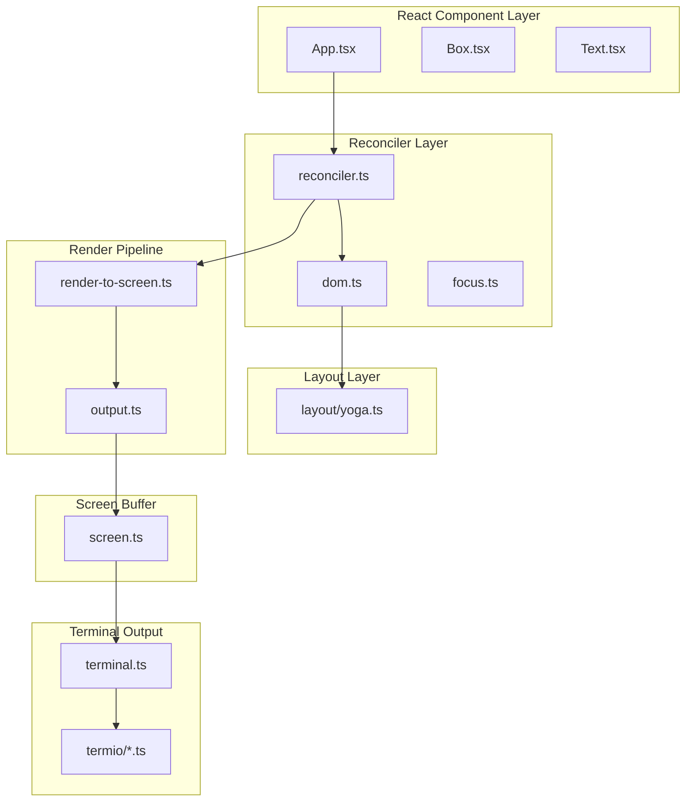

# Claude Code Leaked - 整体架构文档

**生成日期**: 2026-04-02  
**项目版本**: 1.0.3  
**运行时**: Bun >= 1.2.0

---

## 目录

1. [系统概览](#1-系统概览)
2. [核心架构模块](#2-核心架构模块)
3. [状态管理系统](#3-状态管理系统)
4. [终端渲染引擎](#4-终端渲染引擎)
5. [工具系统](#5-工具系统)
6. [任务系统](#6-任务系统)
7. [命令和快捷键系统](#7-命令和快捷键系统)
8. [服务和桥接层](#8-服务和桥接层)
9. [构建系统](#9-构建系统)
10. [架构决策和设计模式](#10-架构决策和设计模式)

---

## 1. 系统概览

### 1.1 项目定位

Claude Code Leaked 是一个基于 React/TypeScript 的**终端 AI 助手应用**，是 Anthropic Claude Code CLI 的逆向工程版本。应用采用 **Ink 渲染引擎**（React for Terminal）实现富终端 UI，支持多代理协作、工具调用、任务管理等高级功能。

### 1.2 技术栈

| 层级 | 技术选型 |
|------|----------|
| 运行时 | Bun >= 1.2.0 |
| 语言 | TypeScript 6.0+ |
| UI 框架 | React 19 + Ink (自定义 terminal reconciler) |
| 布局引擎 | Facebook Yoga (Flexbox) |
| 状态管理 | 自研轻量级 Store + React Context |
| 特性管理 | GrowthBook + Bun feature() |
| API 集成 | Anthropic SDK, AWS Bedrock, Azure Foundry, Google Vertex |
| MCP | Model Context Protocol SDK |

### 1.3 整体架构图

```
┌─────────────────────────────────────────────────────────────────┐
│                         CLI 入口层                               │
│  (src/entrypoints/cli.tsx, src/main.tsx)                        │
├─────────────────────────────────────────────────────────────────┤
│                         初始化层                                 │
│  (src/bootstrap/, src/setup.ts, src/context/)                   │
├─────────────────────────────────────────────────────────────────┤
│                         UI 渲染层                                │
│  ┌─────────────────────────────────────────────────────────┐    │
│  │  React Components (src/components/, src/screens/)       │    │
│  │  ↓                                                      │    │
│  │  Ink Renderer (src/ink/) - React Reconciler for Terminal│    │
│  │  ↓                                                      │    │
│  │  ANSI Output (src/ink/termio/)                          │    │
│  └─────────────────────────────────────────────────────────┘    │
├─────────────────────────────────────────────────────────────────┤
│                         状态管理层                               │
│  ┌─────────────────────────────────────────────────────────┐    │
│  │  AppState Store (src/state/)                            │    │
│  │  Custom Hooks (src/hooks/)                              │    │
│  └─────────────────────────────────────────────────────────┘    │
├─────────────────────────────────────────────────────────────────┤
│                         核心功能层                               │
│  ┌─────────────┬─────────────┬─────────────┬─────────────────┐  │
│  │ 工具系统     │ 任务系统     │ 命令系统     │ 技能/插件系统    │  │
│  │ (src/tools) │ (src/tasks) │(src/commands)│ (src/skills)   │  │
│  └─────────────┴─────────────┴─────────────┴─────────────────┘  │
├─────────────────────────────────────────────────────────────────┤
│                         服务集成层                               │
│  ┌─────────────────────────────────────────────────────────┐    │
│  │  API Clients (Anthropic, AWS, Azure, Google)            │    │
│  │  MCP Services (src/services/mcp/)                       │    │
│  │  Remote Bridge (src/bridge/, src/remote/)               │    │
│  └─────────────────────────────────────────────────────────┘    │
└─────────────────────────────────────────────────────────────────┘
```

---

## 2. 核心架构模块

### 2.1 应用入口 (src/main.tsx, src/entrypoints/)

**职责**: 处理 CLI 命令注册、执行和初始化流程。

**关键设计**:
- 使用 Commander.js 进行命令解析
- `preAction` 钩子统一初始化逻辑
- 特性标志门控控制功能加载

### 2.2 引导流程 (src/bootstrap/, src/setup.ts)

**多阶段初始化策略**:

```
1. Fast-path 检测 (--version, --help 等)
   ↓
2. 特性标志检查 (GrowthBook)
   ↓
3. 配置加载 (~/.claude/config.json)
   ↓
4. 信任对话框 (首次运行)
   ↓
5. 完整初始化 (init() 函数)
   ↓
6. Telemetry 设置
   ↓
7. UI 渲染
```

**init() 函数执行内容**:
- `enableConfigs()` - 配置系统初始化
- `applySafeConfigEnvironmentVariables()` - 安全环境变量注入
- `setupGracefulShutdown()` - 优雅退出处理 (SIGINT/SIGTERM)
- `initialize1PEventLogging()` - 事件日志
- `configureGlobalMTLS()` - mTLS 配置
- `configureGlobalAgents()` - 代理配置
- `preconnectAnthropicApi()` - API 连接预热

### 2.3 React Context 层次

```
<StatsProvider>          // 指标统计 (水库采样 P50/P95/P99)
  <MailboxProvider>      // 消息信箱
    <NotificationProvider> // 通知队列 (优先级队列)
      <OverlayProvider>  // 覆盖层状态
      <ModalProvider>    // 模态框
      <FPSProvider>      // FPS 性能指标
        <App>            // 主应用组件
```

### 2.4 全局状态模块 (src/bootstrap/state.ts)

**设计思想**: 模块级私有状态 + 公共访问器

```typescript
const STATE: State = getInitialState()

export function getSessionId(): SessionId {
  return STATE.sessionId
}

export function switchSession(sessionId: SessionId, projectDir: string | null = null): void {
  STATE.planSlugCache.delete(STATE.sessionId)
  STATE.sessionId = sessionId
  STATE.sessionProjectDir = projectDir
  sessionSwitched.emit(sessionId)  // 观察者模式
}
```

---

## 3. 状态管理系统

### 3.1 架构概述

系统采用**自研的轻量级 Store 模式**，核心设计特点:

- **非 Redux/Zustand**: 自行实现的微型 Store（约 30 行代码）
- **不可变更新**: 通过 `(prev: T) => T` 更新器模式实现不可变状态更新
- **发布订阅**: 基于 `Set<Listener>` 的简单订阅机制
- **React 集成**: 通过 `AppStateProvider` + `useAppState` hooks 暴露到组件层
- **选择器优化**: 使用 `useSyncExternalStore` 实现细粒度订阅

### 3.2 架构层次

```
┌─────────────────────────────────────────┐
│  React Components (hooks 消费层)          │
│  useAppState, useSettings, useTasksV2   │
├─────────────────────────────────────────┤
│  React Context (AppStoreContext)        │
│  AppStateProvider                       │
├─────────────────────────────────────────┤
│  Store (核心状态管理)                      │
│  getState / setState / subscribe        │
├─────────────────────────────────────────┤
│  onChangeAppState (状态变更副作用处理)     │
└─────────────────────────────────────────┘
```

### 3.3 AppState 主要状态字段

**核心配置类**:
- `settings: SettingsJson` - 用户设置
- `verbose: boolean` - 详细日志模式
- `mainLoopModel: ModelSetting` - 主循环模型配置
- `thinkingEnabled: boolean` - 思考模式开关

**任务管理类**:
- `tasks: { [taskId: string]: TaskState }` - 所有任务状态
- `todos: { [agentId: string]: TodoList }` - 待办事项
- `viewingAgentTaskId?: string` - 当前查看的代理任务 ID

**权限与安全类**:
- `toolPermissionContext: ToolPermissionContext` - 工具权限上下文
- `permissionMode: PermissionMode` - 权限模式

**MCP/插件类**:
- `mcp: { clients, tools, commands, resources }` - MCP 服务状态
- `plugins: { enabled, disabled, commands, errors }` - 插件系统

**远程会话类**:
- `replBridgeEnabled/Connected/SessionActive` - 桥接状态
- `remoteSessionUrl`, `remoteConnectionStatus`

**UI 状态类**:
- `footerSelection: FooterItem | null` - 底部选中项
- `activeOverlays: ReadonlySet<string>` - 活动覆盖层

### 3.4 状态更新流程

```
用户操作/系统事件
       │
       ▼
┌─────────────────┐
│  setAppState    │  (来自 useSetAppState 或 store.setState)
│  (updater fn)   │
└────────┬────────┘
         │
         ▼
┌─────────────────┐
│  updater(prev)  │  纯函数返回新状态
│  → nextState    │
└────────┬────────┘
         │
         ▼
┌─────────────────┐
│  Object.is 比较  │  如果相同则提前返回
└────────┬────────┘
         │
         ▼
┌─────────────────┐
│  onChangeAppState│  副作用处理（持久化、通知等）
│  (可选回调)      │
└────────┬────────┘
         │
         ▼
┌─────────────────┐
│  listeners 通知  │  触发所有订阅者
└────────┬────────┘
         │
         ▼
┌─────────────────┐
│  useSyncExternal │  React 选择性重渲染
│  Store 捕获变化   │
└─────────────────┘
```

### 3.5 关键 Hooks

| Hook | 职责 |
|------|------|
| `useAppState(selector)` | 带选择器的状态订阅 |
| `useSetAppState()` | 稳定的状态更新器 |
| `useSettings()` | 设置订阅 |
| `useTasksV2()` | 任务状态订阅 (单例 Store 模式) |
| `useTextInput()` | 文本输入状态 (Emacs 风格快捷键) |
| `useVoice()` | 语音输入状态机 |
| `useCommandQueue()` | 外部命令队列订阅 |

---

## 4. 终端渲染引擎

### 4.1 架构概述

基于 **React Reconciler** 构建的终端 UI 渲染系统，将 React 的虚拟 DOM reconciliation 机制与终端的字符网格输出模型相结合。

### 4.2 架构层次

```
┌─────────────────────────────────────────────────────────────┐
│                    React Component Layer                    │
│  (Box, Text, ScrollBox, App, Link, Button, etc.)           │
├─────────────────────────────────────────────────────────────┤
│                   React Reconciler Host                     │
│  (reconciler.ts - custom host config for terminal)          │
├─────────────────────────────────────────────────────────────┤
│                    DOM Abstraction Layer                    │
│  (dom.ts - ink-box, ink-text, ink-root nodes + Yoga)        │
├─────────────────────────────────────────────────────────────┤
│                    Layout Engine (Yoga)                     │
│  (layout/yoga.ts, layout/engine.ts - flexbox layout)        │
├─────────────────────────────────────────────────────────────┤
│                    Render Pipeline                          │
│  (render-node-to-output.ts → output.ts → screen.ts)         │
├─────────────────────────────────────────────────────────────┤
│                    Terminal Output                          │
│  (terminal.ts, termio/* - ANSI escape sequences)            │
└─────────────────────────────────────────────────────────────┘
```

### 4.3 核心渲染流程

```
JSX 组件树
   ↓
Reconciler 创建 DOM 节点 (ink-box/ink-text)
   ↓
Yoga 计算布局 (flexbox)
   ↓
RenderNodeToOutput 递归渲染
   ↓
Output 收集操作 (write/blit/clear)
   ↓
Screen 缓冲区 (Int32Array packed cells)
   ↓
增量 diff (只输出变化的单元格)
   ↓
ANSI 转义序列写入终端
```

### 4.4 关键优化

**Blit 优化** (类似 GPU 的 block image transfer):
```typescript
if (!node.dirty && cached && cached.x === x && cached.y === y) {
  // 节点未变化，从 prevScreen 复制单元格
  output.blit(prevScreen, fx, fy, fw, fh)
  return
}
```

**增量 Damage 追踪**:
```typescript
// 只 diff 变化区域
if (next.damage) {
  region = unionRect(next.damage, prev.damage)
}
```

**Packed Cell 设计** (减少 GC 压力):
```typescript
// 每个单元格 2 个 Int32 (8 字节):
// word0: charId (字符池索引)
// word1: styleId[31:17] | hyperlinkId[16:2] | width[1:0]
```

### 4.5 事件处理机制

实现类似浏览器的**捕获 - 目标 - 冒泡**三阶段事件模型:

```typescript
dispatch(target, event):
  1. 收集所有监听器 (捕获优先，然后冒泡)
  2. 执行调度队列
  3. 处理默认行为
```

### 4.6 架构图 (Mermaid)



---

## 5. 工具系统

### 5.1 架构概述

工具系统是整个 Agent 框架的核心，采用**基于接口的设计模式**，通过统一的 `Tool` 接口管理所有功能模块。

### 5.2 架构层次

```
┌─────────────────────────────────────────────────────────┐
│                    工具管理层 (tools.ts)                 │
│  - 工具注册与发现                                         │
│  - 工具池组装 (assembleToolPool)                         │
├─────────────────────────────────────────────────────────┤
│                    工具抽象层 (Tool.ts)                  │
│  - Tool 接口定义                                         │
│  - buildTool 工厂函数                                    │
├─────────────────────────────────────────────────────────┤
│                    工具实现层 (src/tools/)               │
│  - 核心工具 (Bash, FileRead, FileEdit, etc.)            │
│  - MCP 工具 (动态加载)                                    │
└─────────────────────────────────────────────────────────┘
```

### 5.3 Tool 接口定义

```typescript
type Tool<Input, Output, Progress> = {
  // 基础属性
  readonly name: string
  readonly inputSchema: ZodSchema
  maxResultSizeChars: number
  
  // 核心方法
  call(args, context, onProgress): Promise<ToolResult<Output>>
  description(input): Promise<string>
  prompt(options): Promise<string>
  
  // 权限与安全
  validateInput(input, context): Promise<ValidationResult>
  checkPermissions(input, context): Promise<PermissionResult>
  
  // 行为控制
  isEnabled(): boolean
  isConcurrencySafe(input): boolean
  isReadOnly(input): boolean
  
  // UI 渲染
  renderToolUseMessage(input): React.ReactNode
  renderToolResultMessage(content): React.ReactNode
}
```

### 5.4 工具分类

| 类别 | 工具示例 |
|------|----------|
| 文件操作 | FileReadTool, FileEditTool, FileWriteTool |
| 代码搜索 | GrepTool, GlobTool |
| Shell 执行 | BashTool, PowerShellTool |
| 网络 | WebFetchTool, WebSearchTool |
| 任务管理 | TaskCreateTool, TaskGetTool, TaskUpdateTool |
| Agent 系统 | AgentTool, SendMessageTool |
| MCP | ListMcpResourcesTool, ReadMcpResourceTool |

### 5.5 工具调用流程

```
1. 工具发现: getAllBaseTools() → filterToolsByDenyRules()
   ↓
2. 输入验证: validateInput()
   ↓
3. 权限检查: checkPermissions() → hasPermissionsToUseTool()
   ↓
4. 执行工具: call()
   ↓
5. 结果处理: mapToolResultToToolResultBlockParam()
   ↓
6. UI 渲染: renderToolResultMessage()
```

### 5.6 安全控制设计

**多层安全机制**:

```
┌─────────────────────────────────────────────────────────────┐
│ 第 1 层：静态安全规则                                        │
│ - 阻塞设备路径、UNC 路径、二进制文件                          │
├─────────────────────────────────────────────────────────────┤
│ 第 2 层：权限规则系统                                        │
│ - alwaysAllow / alwaysDeny / alwaysAsk                      │
│ - 通配符模式匹配                                             │
├─────────────────────────────────────────────────────────────┤
│ 第 3 层：工具特定验证                                        │
│ - 文件存在性、大小限制、token 限制                           │
├─────────────────────────────────────────────────────────────┤
│ 第 4 层：AI 分类器 (Auto Mode)                               │
│ - Transcript Classifier 评估危险操作                        │
├─────────────────────────────────────────────────────────────┤
│ 第 5 层：Hooks 系统                                          │
│ - PreToolUse / PostToolUse Hooks                           │
└─────────────────────────────────────────────────────────────┘
```

---

## 6. 任务系统

### 6.1 架构概述

任务系统是一个**统一的任务管理框架**，用于管理多种类型的后台和前台任务执行。系统采用**策略模式**将任务类型抽象为统一的 `Task` 接口。

### 6.2 架构层次

```
┌─────────────────────────────────────────────────────────────┐
│                      Task Tools Layer                        │
│  (TaskCreateTool, TaskStopTool, TaskGetTool, etc.)          │
├─────────────────────────────────────────────────────────────┤
│                      Task Registry                           │
│  (getAllTasks(), getTaskByType())                           │
├─────────────────────────────────────────────────────────────┤
│                   Task Implementations                       │
│  ┌─────────────┬─────────────┬─────────────┬─────────────┐  │
│  │LocalShellTask│LocalAgentTask│RemoteAgentTask│DreamTask │  │
│  └─────────────┴─────────────┴─────────────┴─────────────┘  │
├─────────────────────────────────────────────────────────────┤
│                    Task Framework                            │
│  (registerTask, updateTaskState, pollTasks)                 │
├─────────────────────────────────────────────────────────────┤
│                    AppState Store                            │
│  tasks: { [taskId: string]: TaskState }                      │
└─────────────────────────────────────────────────────────────┘
```

### 6.3 任务类型分类

| 任务类型 | 前缀 | 用途 |
|----------|------|------|
| `local_bash` | `b` | 本地 Shell 命令 |
| `local_agent` | `a` | 本地 Agent（子代理） |
| `remote_agent` | `r` | 远程 Claude.ai 会话 |
| `in_process_teammate` | `t` | 进程内队友（Swarm） |
| `dream` | `d` | 梦境任务（记忆整合） |

### 6.4 任务状态流转

```
┌─────────┐    ┌─────────┐    ┌─────────┐
│ PENDING │───▶│ RUNNING │───▶│COMPLETED│
└─────────┘    └─────────┘    └─────────┘
                 │   │
                 │   ├───────▶│ FAILED │
                 │              └─────────┘
                 │
                 └───────▶│ KILLED │
                          └─────────┘
```

### 6.5 任务生命周期

```
1. 创建：spawnShellTask() / registerAsyncAgent()
   ↓
2. 注册：registerTask() → AppState.tasks
   ↓
3. 运行：执行命令/代理，输出写入文件
   ↓
4. 轮询：pollTasks() 检查新输出
   ↓
5. 完成：更新 status，发送通知
   ↓
6. 驱逐：evictTerminalTask() 从 AppState 移除
```

---

## 7. 命令和快捷键系统

### 7.1 架构概述

命令系统采用**多层次、模块化**的架构设计，支持三种命令类型和上下文感知的快捷键绑定。

### 7.2 命令类型

| 类型 | 职责 | 示例 |
|------|------|------|
| `prompt` | 向模型发送 prompt，可调用子代理 | `/compact`, `/review` |
| `local` | 纯文本输出 | `/vim`, `/clear`, `/cost` |
| `local-jsx` | 渲染 React 组件 UI | `/help`, `/config`, `/model` |

### 7.3 快捷键系统

**上下文层次**:
```
Global > Chat > Autocomplete > Confirmation > Settings > ...
```

**快捷键格式**:
- 标准格式：`ctrl+shift+k`
- macOS 风格：`cmd+s`
- 和弦键序列：`ctrl+x ctrl+e`

### 7.4 Vim 模式

支持两种编辑器模式:
- **INSERT**: 正常文本输入
- **NORMAL**: Vim 风格命令模式 (h/j/k/l 移动，d/c/y 操作符)

---

## 8. 服务和桥接层

### 8.1 架构概述

服务层采用**分层抽象架构**，支持多种 API 后端和 MCP 协议集成。

### 8.2 架构层次

```
src/
├── services/          # 外部服务集成
│   ├── api/          # Anthropic API 客户端
│   ├── mcp/          # MCP 服务实现
│   ├── oauth/        # OAuth 认证
│   └── tools/        # 工具编排
├── bridge/           # API 桥接层
│   ├── bridgeApi.ts        # 桥接 API 客户端
│   ├── remoteBridgeCore.ts # 无环境桥接核心
│   └── replBridgeTransport.ts # 传输抽象
└── remote/           # 远程会话管理
    ├── RemoteSessionManager.ts # 会话管理器
    ├── SessionsWebSocket.ts    # WebSocket 客户端
    └── sdkMessageAdapter.ts    # 消息适配器
```

### 8.3 API 集成

**支持的 API 后端**:
- Anthropic Direct API
- AWS Bedrock
- Azure Foundry
- Google Vertex AI

### 8.4 MCP 集成

**传输类型**:
| 传输 | 实现类 | 用途 |
|------|--------|------|
| stdio | `StdioClientTransport` | 本地进程通信 |
| SSE | `SSEClientTransport` | 服务器发送事件 |
| HTTP | `StreamableHTTPClientTransport` | HTTP 流式传输 |
| WebSocket | `WebSocketTransport` | 双向通信 |

### 8.5 桥接层工作原理

**v2 模式（直接连接）**:
```
Local REPL → /v1/code/sessions/{id}/bridge (JWT) → CCR Session
```

**核心流程**:
1. 创建会话：`POST /v1/code/sessions` → `session_id`
2. 获取凭据：`POST /v1/code/sessions/{id}/bridge` → `worker_jwt`
3. 建立传输：`createV2ReplTransport()` → SSE + CCRClient
4. 令牌刷新调度：提前 5 分钟刷新 JWT
5. 401 恢复：重新获取 /bridge → 重建传输

---

## 9. 构建系统

### 9.1 架构概述

构建系统基于 **Bun 运行时**，采用 Monorepo 架构管理多个内部包，通过特性标志实现死代码消除和条件性加载。

### 9.2 核心配置

**package.json 脚本**:
```json
{
  "scripts": {
    "build": "bun run build.ts",
    "dev": "bun run scripts/dev.ts",
    "prepublishOnly": "bun run build",
    "lint": "biome lint src/",
    "lint:fix": "biome lint --fix src/",
    "format": "biome format --write src/",
    "prepare": "git config core.hooksPath .githooks",
    "test": "bun test",
    "check:unused": "knip-bun",
    "health": "bun run scripts/health-check.ts",
    "docs:dev": "npx mintlify dev"
  }
}
```

**Monorepo Workspaces**:
```json
{
  "workspaces": [
    "packages/*",
    "packages/@ant/*"
  ]
}
```

**引擎约束**:
```json
{
  "engines": {
    "bun": ">=1.2.0"
  }
}
```

### 9.3 TypeScript 配置

```json
{
  "compilerOptions": {
    "target": "ESNext",
    "module": "ESNext",
    "moduleResolution": "bundler",
    "jsx": "react-jsx",
    "strict": false,
    "skipLibCheck": true,
    "noEmit": true,
    "esModuleInterop": true,
    "allowSyntheticDefaultImports": true,
    "resolveJsonModule": true,
    "types": ["bun"],
    "paths": {
      "src/*": ["./src/*"]
    }
  },
  "include": ["src/**/*.ts", "src/**/*.tsx"],
  "exclude": ["node_modules"]
}
```

**关键设计决策**:
- `noEmit: true` - TypeScript 仅用于类型检查，不生成输出文件
- `moduleResolution: "bundler"` - 使用 Bun 的 bundler 模式进行模块解析
- `types: ["bun"]` - 使用 Bun 运行时类型定义
- `paths` 配置支持 `src/*` 别名导入

### 9.4 开发和生产流程

**CLI 入口快速路径检测**:

```
1. --version / -v / -V → 直接输出版本号 (零模块加载)
2. --dump-system-prompt → 输出系统提示
3. --claude-in-chrome-mcp → 运行 Chrome MCP 服务器
4. --daemon-worker=<kind> → 守护进程工作节点
5. remote-control / rc / remote / sync / bridge → 桥接模式
6. daemon → 守护进程
7. ps / logs / attach / kill / --bg → 后台会话管理
8. new / list / reply → 模板作业命令
9. environment-runner → BYOC 运行器
10. self-hosted-runner → 自托管运行器
11. --worktree --tmux → tmux 工作树模式
12. 默认 → 加载完整 CLI
```

**初始化流程**:
```
1. 快速路径检测
   ↓
2. 特性标志检查 (GrowthBook)
   ↓
3. 配置加载 (~/.claude/config.json)
   ↓
4. 信任对话框 (首次运行)
   ↓
5. 完整初始化 (init() 函数)
   - enableConfigs()
   - applySafeConfigEnvironmentVariables()
   - setupGracefulShutdown()
   - initialize1PEventLogging()
   - configureGlobalMTLS()
   - configureGlobalAgents()
   - preconnectAnthropicApi()
   ↓
6. Telemetry 设置
   ↓
7. UI 渲染 (React Ink)
```

### 9.5 依赖管理策略

**内部 Workspace 包**:
| 包名 | 用途 |
|------|------|
| `@ant/claude-for-chrome-mcp` | Chrome MCP 集成 |
| `@ant/computer-use-input` | 计算机视觉输入 |
| `@ant/computer-use-mcp` | 计算机视觉 MCP |
| `@ant/computer-use-swift` | Swift 计算机视觉 |
| `audio-capture-napi` | 音频捕获 NAPI |
| `color-diff-napi` | 颜色差异 NAPI |
| `image-processor-napi` | 图像处理 NAPI |
| `modifiers-napi` | 修饰键 NAPI |
| `url-handler-napi` | URL 处理器 NAPI |

**关键外部依赖**:
| 类别 | 依赖包 |
|------|--------|
| Anthropic SDK | `@anthropic-ai/sdk`, `@anthropic-ai/bedrock-sdk`, `@anthropic-ai/vertex-sdk` |
| AWS | `@aws-sdk/client-bedrock`, `@aws-sdk/credential-provider-node` |
| Azure | `@azure/identity` |
| Google | `google-auth-library` |
| MCP | `@modelcontextprotocol/sdk`, `@anthropic-ai/mcpb` |
| React | `react` (^19.2.4), `react-reconciler` |
| UI/终端 | `chalk`, `wrap-ansi`, `strip-ansi`, `supports-hyperlinks` |
| 代码质量 | `@biomejs/biome`, `knip` |

**版本管理**:
- 使用 `^` (caret) 进行语义版本锁定
- 允许 minor/patch 更新，阻止 major 更新
- 内部包使用 `workspace:*` 协议

### 9.6 代码质量保障

**Linting 和 Formatting**:
```bash
bun run lint       # Biome lint
bun run lint:fix   # Biome lint --fix
bun run format     # Biome format --write
```

**Git Hooks**:
```json
{
  "prepare": "git config core.hooksPath .githooks"
}
```

**未使用代码检测**:
```bash
bun run check:unused  # Knip 检测未使用的依赖/文件/导出
```

**健康检查**:
```bash
bun run health  # 运行健康检查脚本
```

### 9.7 构建优化措施

**特性标志和死代码消除**:
```typescript
import { feature } from 'bun:bundle';

// 构建时 DCE (Dead Code Elimination)
if (feature('BRIDGE_MODE') && args[0] === 'remote-control') {
  // 仅在启用时包含此代码
}
```

**动态导入和代码分割**:
```typescript
// 快速路径：零模块加载
if (args.length === 1 && args[0] === '--version') {
  console.log(`${MACRO.VERSION} (Claude Code)`);
  return;
}

// 条件性动态导入
const { main: cliMain } = await import('../main.js');
```

**并行预取优化**:
```typescript
// 在模块加载前启动并行任务
startMdmRawRead();      // MDM 配置读取
startKeychainPrefetch(); // Keychain 凭证预取
```

**启动分析器**:
```typescript
import { profileCheckpoint, profileReport } from './utils/startupProfiler.js';

profileCheckpoint('main_tsx_entry');
// ... 关键路径
profileCheckpoint('cli_after_main_import');
profileReport();
```

**宏内联**:
```typescript
// MACRO.VERSION 在构建时内联
console.log(`${MACRO.VERSION} (Claude Code)`);
```

### 9.8 工程化最佳实践

| 方面 | 实践 |
|------|------|
| **运行时选择** | Bun - 现代、快速的 JavaScript 运行时 |
| **类型系统** | TypeScript 6.0+ with path aliases |
| **构建策略** | 特性标志 + 死代码消除 + 动态导入 |
| **代码质量** | Biome (统一 linting/formatting) |
| **依赖管理** | Monorepo workspaces + 语义版本 |
| **性能优化** | 并行预取、增量渲染、缓存策略 |
| **安全设计** | 多层防御机制 |
| **可维护性** | 模块化架构、清晰的层次划分 |

---

## 10. 架构决策和设计模式

### 9.1 核心设计模式

| 模式 | 应用位置 |
|------|----------|
| **Strategy** | 工具实现、任务类型 |
| **Factory** | buildTool 工厂函数 |
| **Composite** | assembleToolPool 组合工具 |
| **Chain of Responsibility** | 权限检查管道 |
| **Observer** | Store 订阅、事件系统 |
| **Provider** | React Context 层次 |

### 9.2 架构决策

1. **React for Terminal**: 使用 react-reconciler 将 React 模式适配到终端，开发者可用熟悉的 React 模式编写终端 UI

2. **轻量级 Store**: 自研约 30 行的 Store 实现，够用即可，避免 Redux/Zustand 的复杂性

3. **不可变状态**: 所有状态更新通过 `(prev) => next` 纯函数，支持时间旅行调试和乐观更新

4. **增量渲染**: Blit 优化 + Damage 追踪 + Packed Cells，实现高效的终端刷新

5. **多层安全**: 静态规则 → 权限系统 → 工具验证 → AI 分类器 → Hooks，深度防御

6. **特性开关**: 通过 GrowthBook 和 Bun feature() 实现条件性加载和 A/B 测试

### 9.3 扩展点

1. **添加新工具**: 实现 Tool 接口 + buildTool + 注册到 tools.ts
2. **添加 MCP 服务器**: 配置 settings.json + 自动发现
3. **自定义快捷键**: `~/.claude/keybindings.json`
4. **插件系统**: `~/.claude/plugins/*/commands/`
5. **技能系统**: `.claude/skills/` 目录 + SKILL.md
6. **构建系统**: 通过 `bun:bundle` feature() API 控制条件性加载

---

## 附录：关键文件路径

| 模块 | 核心文件 |
|------|----------|
| 入口 | `src/main.tsx`, `src/entrypoints/cli.tsx` |
| 状态 | `src/state/AppStateStore.ts`, `src/state/store.ts` |
| 渲染 | `src/ink/reconciler.ts`, `src/ink/renderer.ts` |
| 工具 | `src/Tool.ts`, `src/tools.ts` |
| 任务 | `src/Task.ts`, `src/tasks/` |
| 命令 | `src/commands.ts`, `src/keybindings/` |
| 服务 | `src/services/`, `src/bridge/`, `src/remote/` |

---

*本文档由 sub-agent 并行分析生成，涵盖了 Claude Code Leaked 项目的核心架构设计。*
