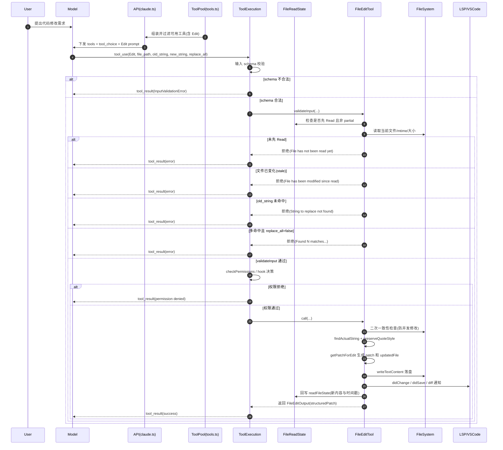

# FileEditTool 触发机制与工作原理（完善版）

本文从“模型如何触发 Edit 工具”到“工具如何安全落盘”完整梳理 `FileEditTool` 的运行链路，并补充关键错误分支与调试定位点。

## 1. 总体架构

`FileEditTool` 不是被事件自动触发，而是由模型在一次对话推理中主动选择调用。

高层链路：

1. 工具注册进入可用工具池。
2. API 请求将工具 schema 与 prompt 一并发送给模型。
3. 模型决定发起 `tool_use(name="Edit")`。
4. 运行时执行 `schema 解析 -> validateInput -> checkPermissions -> call`。
5. 生成 patch、写入文件、更新状态并返回 `tool_result`。

对应关键文件：

- `src/tools/FileEditTool/FileEditTool.ts`
- `src/tools/FileEditTool/prompt.ts`
- `src/tools/FileEditTool/utils.ts`
- `src/services/tools/toolExecution.ts`
- `src/tools.ts`
- `src/services/api/claude.ts`

## 2. 触发机制（模型何时会调用 Edit）

### 2.1 工具如何暴露给模型

`FileEditTool` 通过 `buildTool` 注册，名字固定为 `Edit`：

- `src/tools/FileEditTool/constants.ts`: `FILE_EDIT_TOOL_NAME = 'Edit'`
- `src/tools/FileEditTool/FileEditTool.ts`: `export const FileEditTool = buildTool({...})`

工具会在工具池组装时加入：

- 默认模式：`getAllBaseTools()` 包含 `FileEditTool`
- simple 模式：仅保留 `BashTool + FileReadTool + FileEditTool`

如果被 deny 规则命中，会在暴露前被过滤，模型根本看不到该工具。

### 2.2 工具描述如何影响触发概率

`FileEditTool.prompt()` 返回工具说明文本（`getEditToolDescription()`），告诉模型应如何构造参数和规避失败。

关键提示包括：

- 必须先 Read 再 Edit。
- `old_string/new_string` 不能包含行号前缀。
- `old_string` 需唯一，否则要补充上下文或设置 `replace_all=true`。

你提到的 `minimalUniquenessHint` 位于 `src/tools/FileEditTool/prompt.ts`：

- 仅在 `process.env.USER_TYPE === 'ant'` 时附加。
- 作用是“提示模型更倾向给最小且唯一的 old_string（通常 2-4 行）”。
- 它是提示层优化，不是最终判定逻辑。

### 2.3 请求发送到模型时的载荷

API 侧会把工具数组和 `tool_choice` 一并发送：

- `src/services/api/claude.ts`: `tools: allTools`, `tool_choice: options.toolChoice`

是否附带 `strict` 字段，受工具本身 `strict: true`、feature gate 以及模型能力共同决定。

## 3. 运行时执行链路（从 tool_use 到落盘）

`toolExecution` 的执行顺序是：

1. 参数 schema 校验。
2. `tool.validateInput(...)`。
3. `resolveHookPermissionDecision(...)` + 权限决策。
4. `tool.call(...)` 真正执行业务。

这也是 `Tool` 接口注释中定义的顺序：`checkPermissions` 仅在 `validateInput` 通过后执行。

## 4. validateInput 详细校验（FileEditTool 的第一道硬门）

`src/tools/FileEditTool/FileEditTool.ts` 的 `validateInput` 做了大量防护：

1. **路径与输入预处理**

- 规范化 `file_path`（`expandPath`）。
- 拒绝 team memory 文件中的 secret 注入。

2. **无效编辑拒绝**

- `old_string === new_string` 直接拒绝。

3. **权限规则预检查**

- 若命中 deny 规则，直接返回拒绝。

4. **文件大小保护**

- 超过 1 GiB（`MAX_EDIT_FILE_SIZE`）拒绝，避免 OOM。

5. **文件存在性与“新建语义”判定**

- 文件不存在 + `old_string === ''`：允许（视作创建）。
- 文件不存在 + `old_string !== ''`：拒绝并给路径建议。
- 文件已存在 + `old_string === ''` + 文件非空：拒绝（防止覆盖式误创建）。

6. **文件类型限制**

- `.ipynb` 禁止用 Edit，必须走 NotebookEditTool。

7. **先读后写强约束**

- `readFileState` 没记录或是 partial view，拒绝并提示先 Read。

8. **防陈旧写入（stale write）**

- 若文件在 Read 后被修改，拒绝并要求重新 Read。
- 对 Windows 时间戳抖动有内容比对兜底，减少误报。

9. **匹配与唯一性校验**

- 通过 `findActualString` 支持弯引号/直引号归一化匹配。
- 找不到匹配：拒绝。
- 多匹配且 `replace_all=false`：拒绝并提示扩上下文或开启 `replace_all`。

10. **设置文件专项校验**

- 对特定 settings 文件执行额外合法性验证，防止结构损坏。

## 5. call 阶段工作原理（第二道保护 + 实际写入）

`call(...)` 不是直接 replace 后写盘，而是“先确认一致性再提交”：

1. 准备阶段

- 获取绝对路径。
- 触发动态 skills 目录发现/激活（非 simple 模式）。
- 预先建父目录。
- 如果启用 file history，先记录可回溯信息。

2. 原子化关键区（尽量避免中间异步切换）

- 读取当前文件元数据与内容（`readFileForEdit`）。
- 再做一次“自上次 read 后是否变化”检查。
- 若变化且内容不一致，抛出 `FILE_UNEXPECTEDLY_MODIFIED_ERROR`。

3. 文本替换与 patch 生成

- 用 `findActualString` 获取真实匹配片段。
- 用 `preserveQuoteStyle` 在归一化匹配场景保留原有弯引号风格。
- `getPatchForEdit(...)` 生成结构化 patch 与 `updatedFile`。

4. 落盘与通知

- `writeTextContent(...)` 按原编码与行尾风格写回。
- 通知 LSP `didChange/didSave`，并清理旧诊断。
- 通知 VSCode 文件已更新，用于 diff 展示。

5. 状态回写与结果返回

- 更新 `readFileState`（新内容 + 新时间戳）。
- 上报日志/指标（长度、行变更等）。
- 返回 `FileEditOutput`，供 UI 渲染变更结果。

## 6. Read 与 Edit 的状态协同

`Read` 工具会把读取结果写入 `readFileState`：

- 记录内容、timestamp、offset、limit。

`Edit` 工具基于这些状态做两类判断：

1. 你是否读过该文件（且不是 partial）。
2. 文件是否在你读取后又被改动。

这套机制用于降低“盲改”和“覆盖他人/格式化器新改动”的风险。

## 7. 常见失败分支与排查建议

1. `File has not been read yet`

- 原因：未先 Read 或 read 是 partial view。
- 处理：先完整 Read 再 Edit。

2. `File has been modified since read`

- 原因：read 后文件被用户、linter、其他进程改动。
- 处理：重新 Read，基于新内容生成 old_string。

3. `String to replace not found`

- 原因：old_string 不精确（缩进、引号、换行、空格差异）。
- 处理：从最新 Read 结果原样复制文本片段。

4. `Found N matches ... replace_all is false`

- 原因：old_string 不唯一。
- 处理：补足前后文使其唯一，或显式 `replace_all=true`。

5. `Cannot create new file - file already exists`

- 原因：`old_string=''` 但目标文件非空。
- 处理：改为正常替换流程，提供 old_string。

6. `.ipynb` 被拒

- 原因：工具类型不匹配。
- 处理：使用 NotebookEditTool。

## 8. 与提示词变量 minimalUniquenessHint 的关系

`minimalUniquenessHint` 只负责“给模型更好策略”：

- 倾向选择最小唯一 old_string。
- 降低因上下文过长导致 mismatch 的概率。
- 减少 patch 噪音与误命中。

它不改变任何校验条件。真正是否通过，完全由 `validateInput` 和 `call` 阶段的硬逻辑决定。

## 9. 一次成功 Edit 的最小心智模型

1. 先 Read（完整读取目标文件）。
2. 从 Read 输出中复制精确 old_string（不带行号前缀）。
3. 保持缩进与换行风格一致。
4. old_string 若多处出现：要么加上下文唯一化，要么 `replace_all=true`。
5. 若报 stale：重新 Read 再改，不复用旧片段。

按这个模型，`FileEditTool` 基本可以稳定通过，并保持可审计、可回滚、低竞态风险。

## 10. 流程图（Mermaid 时序图）

图中关键观察点：

1. Edit 的失败多数发生在 `validateInput`，不是写盘阶段。
2. “先 Read 再 Edit”是硬约束，不满足会直接拦截。
3. 写盘前还有二次一致性检查，降低并发覆盖风险。
4. 成功后会同步 LSP/VSCode 与 `readFileState`，保证后续编辑基于最新状态。
